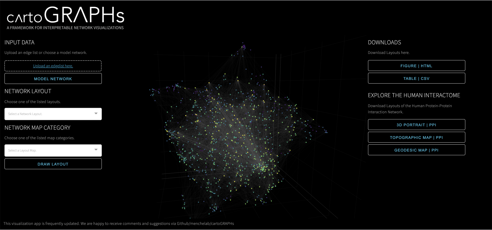

# cartoGRAPHs_app
A webbased network visualization framework complementing the manuscript "cartoGRAPHs - A Framework for Interpretable Network Visualizations". 

&nbsp;

&nbsp;

### INTRO

The app will load an exemplary visualisation at the very beginning. This exemplary network can be used to explore the functionality of the application. 
A network edgelist generated using the [networkx package](https://networkx.org/) can be used to upload a network of choice and generate different layouts and maps. 
The following paragraph will introduce the basic step-wise functionality of this application. Please note that this application is under development and will be frequently updated and improved. 

##### 1 | Set Input Data
To inspect an exemplary graph, please click the button stating *MODEL NETWORK* or upload a networkx edgelist (.csv or .txt format), with node IDs.
An examplary graph input file can be found here (insert link).

##### 2 | Choose Network Layout and Network Map 
When the upload is finished, the spinning wheel disappears and Network Layouts and Maps can be chosen and the button “Draw Layout” shall be pressed to draw the layout with a given input graph. 

To inspect the layouts rotate, zoom, hover over data points.
The data point hover information will display node ID. This feature will be extended soon, to upload for example node annotations.

##### 3 | Download your Layout
To download a 2D or 3D layout, the respective button, i.e. *FIGURE | HTML* shall be used. 
To download a csv file to be used for import into the VRNetzer platform (Pirch et al., 2021) please press *TABLE | CSV*. 

---

### COMPUTATION
Depending on network size (number of nodes and edges), the calculations will take between seconds or up to a few minutes. A more in detail description of computational time to expect for a range of networks between 100 up to 20,000 nodes will be added here. 

---
 
### SUPPLEMENTARY INFORMATION
Figures illustrated in the manuscript “CartoGRAPHs - A Framework for interpretable Network Visualisations” can be viewed choosing the respective buttons for Network Portraits or Topographic and Geodesic Network Maps on the right in the section “Explore the Human Interactome”.
